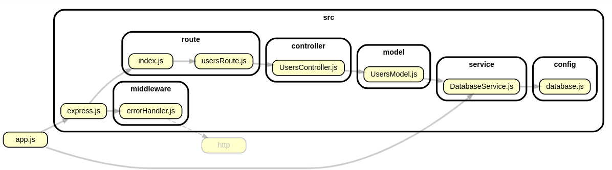

Exercise: Build a JSON REST API server for CRUD a users collection with a MariaDB (MySQL) database
==============================

This example shows how to perform CRUD (Create, Read, Update, Delete) towards a REST API server working with JSON. You will work towards a collection of users and they will be stored in a database like MariaDB or MySQL.

You will be using the MVC design pattern (Model View Controller) to organise the code within the application server Express.

[[_TOC_]]

<!--
TODO

* 

-->


<!--
Video
-----------------------------

This is a recorded presentation, 18 minutes long (English), when Mikael goes through the content of this article.

[](https://www.youtube.com/watch?v=wM1RPbxamC4)
-->


Preconditions
-----------------------------

You have performed the exercise "[Node menu terminal program doing CRUD to MariaB (MySQL) database using MVC](../cli-crud/README.md)".

You have also performed the exercise "[Exercise: Build a JSON REST API server for CRUD](../../../json-crud/README.md)".

This exercise builds upon the work done in that exercises.


Get going with this example program
-----------------------------

There are two ways to get going with this example program to make it run on your own computer. The first is to clone the example repo and use the code there. The other is to create the code, step by step, in your own setup.

Here is how to get going by cloning the repo.

```
git clone https://gitlab.com/mikael-roos/node.git
cd node

cd src/express5/database/mariadb/json-crud
npm install
npm run dev
```

Open your browser (and postman) to the server on the port where it started.

Read on to see how to setup the code in your own express project.


The REST API
-----------------------------

The example code has implemented the following REST API for a collection of users.

| Request     | Description |
|--------------|------------|
| `GET users`  | View all users. |
| `POST users`  | Add a new user. Send the data as JSON in the body. |
| `PUT users/<id>`  | Update an user with the id. Send the data as JSON in the body. |
| `DELETE users/<id>`  | Delete a user with the specified id. |

The schema for the user in the users collection are like this.

```json
{
    "id": 1,
    "username": "alice",
    "password": "password123",
    "email": "alice@example.com",
    "created_at": "2025-02-07T11:49:49.000Z",
    "updated_at": "2025-02-07T11:49:49.000Z"
}
```

When you add a new user you may supply these parts.

```json
{
  "username": "mos",
  "password": "som",
  "email": "mos@somewhere.se"
}
```

When you PUT (update) an object you need to send all parts of the object data.

```json
{
  "username": "mos",
  "password": "really hard password",
  "email": "mos@somewhere.se"
}
```


A walkthough of the code in this example
-----------------------------

Here is the overview of the code structure.


_Figure. The various code part of this example program._


Lets go through each code part, step by step, and try to figure out how the different parts connect to each other.


### `app.js`

This is the start of the application and we start both the database service and the express application server. Both are needed for the application to work.

```js
import { app } from './src/express.js'
import databaseService from "./src/service/DatabaseService.js"

// Connect to the database
await databaseService.connect()

// Start the express server
const port = process.env.PORT || 3000

app.listen(port, () => {
  console.log(`Listening on port ${port}`)
})
```

Review the source code for [`app.js`](./app.js).


### `src/express.js`

The configuration for the express server looks like the last time. Nothing has changed here.

The database service is not part of the configuration of the application server itself, it is just a dependency to the users model.

Review the source code for [`src/express.js`](./src/express.js).


### Routes `src/route/usersRoute.js`

The users route looks pretty much like before, but the difference is that we opted to implement the controller as a class instead of functions. That is why it looks slightly different in how each route maps to a controller callback.

```js
import express from 'express'
import controller from '../controller/UsersController.js'

export const router = express.Router()

router.param('id', (req, res, next, id) => controller.verifyUserId(req, res, next, id))

router.get('/users', (req, res, next) => controller.getAllUsers(req, res, next))
router.post('/users', (req, res, next) => controller.addUser(req, res, next))
router.put('/users/:id', (req, res, next) => controller.updateUser(req, res, next))
router.delete('/users/:id', (req, res, next) => controller.deleteUser(req, res, next))
```

One could argue if a controller is best suited to be implemented using a module with functions or as a class, both ways work and they produce quite similair code.

Review the source code for [`src/route/usersRoute.js`](./src/route/usersRoute.js).


### Controller `src/controller/UsersController.js`

The UsersController is then implemented as a class in this example. But as before, each method is mapped towards a route being its handler. We call this controller actions, they are actions to solve a route path.

We try to keep the controller "thin" so it only contains the code needed to glue it between the request and the response. The models can be "fat" and contain a lot of code, but the controller should be "thin" and "skiny" and contain as little code as possible.

<details>
<summary>Source code for the controller.</summary>

```js
import usersModel from '../model/UsersModel.js'

/**
 * Controller to perform CRUD fo rhte users collection.
 * @class
 */
class UsersController {
  /**
   * Middleware to verify the user ID.
   * @param {Request} req - The request object.
   * @param {Response} res - The response object.
   * @param {function} next - The next middleware function.
   * @param {string} id - The user ID as a string.
   */
  verifyUserId (req, res, next, id) {
    try {
      req.userId = usersModel.verifyUserId(id)
      next()
    } catch (error) {
      res.status(400).json({ error: error.message })
    }
  }

  /**
   * Show all users by fetching data from the model and return the json response.
   * @async
   */
  async getAllUsers(req, res, next) {
    try {
      const users = await usersModel.getAllUsers()
      res.json(users)
    } catch (error) {
      next(error)
    }
  }

  /**
   * Add a new user to the database.
   * @async
   * @param {string} name - The name of the user.
   * @param {string} email - The email of the user.
   * @param {string} password - The password for the user.
   */
  async addUser(req, res, next) {
    try {
      const user = req.body
      const id = await usersModel.addUser(user)
      res.status(201).json(id)
    } catch (error) {
      next(error)
    }
  }

  /**
   * Update an existing user in the database.
   * @async
   * @param {number} id - The ID of the user to update.
   * @param {string} name - The new name of the user.
   * @param {string} email - The new email of the user.
   */
  async updateUser(req, res, next) {
    try {
      const user = req.body
      const success = await usersModel.updateUser(req.userId, user)
      if (success) {
        res.json(user)
      } else {
        res.status(404).json({ error: 'User not found' })
      }
    } catch (error) {
      next(error)
    }
  }

  /**
   * Delete a user from the database.
   * @async
   * @param {number} id - The ID of the user to delete.
   */
  async deleteUser(req, res, next) {
    try {
      const success = await usersModel.deleteUser(req.userId)
      if (success) {
        res.json({ result: 'User deleted' })
      } else {
        res.status(404).json({ error: 'User not found' })
      }
    } catch (error) {
      next(error)
    }
  }
}

export default new UsersController()
```

</details>

Review the source code for [`src/controller/UsersController.js`](./src/controller/UsersController.js).


### Model `src/model/UsersModel.js`

The model class prepares the requests towards the database and executes them to maintain the collection of users.

The model class is dependent on the database service.

<details>
<summary>Source code for the model.</summary>

```js
import databaseService from "../service/DatabaseService.js"

/**
 * Model to interact with the 'users' table in the database.
 * @class
 */
class UsersModel {
  /**
   * Verify and convert user ID.
   * @param {string} id - The user ID as a string.
   * @returns {number} - The verified user ID as an integer.
   * @throws {Error} - Throws an error if the ID format is invalid.
   */
  verifyUserId(id) {
    const userId = parseInt(id)
    if (!Number.isInteger(userId)) {
      throw new Error('Invalid ID format')
    }
    return userId
  }

  /**
   * Get all users from the database.
   * @async
   * @returns {Promise<Array>} An array of users.
   */
  async getAllUsers() {
    const query = "SELECT * FROM user"
    return await databaseService.query(query)
  }

  /**
   * Add a new user to the database.
   * @async
   * @param {object} user - Details for the user.
   * @returns {Promise<number>} The ID of the newly created user.
   */
  async addUser(user) {
    const { username, email, password } = user
    const query = "INSERT INTO user (username, email, password) VALUES (?, ?, ?)"
    const result = await databaseService.query(query, [username, email, password])
    return result.insertId
  }

  /**
   * Update an existing user in the database.
   * @async
   * @param {number} id - The ID of the user to update.
   * @param {object} user - Details of the user to update.
   * @returns {Promise<boolean>} True if the update was successful, false otherwise.
   */
  async updateUser(id, user) {
    const { username, email, password } = user
    const query = "UPDATE user SET username = ?, email = ?, password = ? WHERE id = ?"
    const result = await databaseService.query(query, [username, email, password, id])
    return result.affectedRows > 0
  }

  /**
   * Delete a user from the database.
   * @async
   * @param {number} id - The ID of the user to delete.
   * @returns {Promise<boolean>} True if the deletion was successful, false otherwise.
   */
  async deleteUser(id) {
    const query = "DELETE FROM user WHERE id = ?"
    const result = await databaseService.query(query, [id])
    return result.affectedRows > 0
  }
}

export default new UsersModel()
```

</details>

Review the source code for [`src/model/UsersModel.js`](./src/model/UsersModel.js).


### Database service  `src/service/DatabaseService.js`

We treat the database as a "service" meaning it exists as a service to all code related to the express app. There could be many models that uses the database service to connect to any table in the database.

This example only contains one connection to the database and it is open during the whole application life time and re-used by anyone who wants to use the database.

The database service can be considered as a "Singleton" which is an example of a design pattern where there only exists one instance of this service. The service is a shared resource among all its users.

Review the source code for [`src/service/DatabaseService.js`](./src/service/DatabaseService.js).

The configuration to connect to the database is extracted and put into its own file in the directory `config/`.

Review the source code for [`src/config/database.js`](./src/config/database.js).


Exercises left to the reader
-----------------------------

To really make this code "your own" you need to use it and one way is to try and implement more features into it. Here are some suggestions of features to implement.

Doing so will help you get a better understanding of the code and how it works.


### Show only one user by its id

Add the route `GET users/<id>` to get the details of only one user and send them as a JSON response.

The reponse for this route could look like this.

```
GET users/1
```

```json
{
  "id": 1,
  "username": "alice",
  "password": "password123",
  "email": "alice@example.com",
  "created_at": "2025-02-07T11:49:49.000Z",
  "updated_at": "2025-02-07T11:49:49.000Z"
}
```


### Delete all users

Add a route to delete all users, the whole collection. That can be useful if you want to restart fresh while testing your application.

The route can look like this.

```
DELETE users/1
```

The response should say if the operation was successful or not. Perhaps you also could return how many rows that were deleted.


### Filtering to only show some users

When the collection grows you will need to have the ability to filter the response by for example a search term. You can implement this using the query string, like this.

```
GET users/?search=alice
```

In the controller you need to extract the details from the query string.

```js
const searchString = req.query.search || ''
const users = await usersModel.getUsersBySearchString(searchString)
```

In the model you prepare a SQL that uses the search string to try and match towards the columns you choose.

```js
const query = "SELECT * FROM user WHERE username LIKE ? OR email LIKE ?"
const users = await databaseService.query(query, [`%${searchStr}%`, `%${searchStr}%`])
```

You can create the query string to make more customized filering and searches in your collection.


Summary
-----------------------------

When you have worked through this exercise you should be able to build your own collections that are stored in a database.
